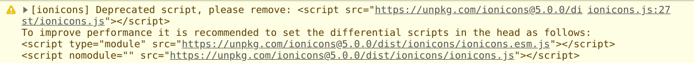

### Setting eslint and Prettier

> If you want to enforce a coding style for your project, consider using *Prettier* instead of *ESLint* style rules.

- Source: https://create-react-app.dev/docs/setting-up-your-editor/#displaying-lint-output-in-the-editor

### React slick

- https://react-slick.neostack.com/docs/api
- Add both `react-slick` and `slick-carousel`
- Imported `.css` files from `slick-carousel` in `index.jsx`

### Ionicon

- 100% free, better than Fontawesome (IMO)
- Included the cdn link in `index.html`
- Get the more updated link (than the one in the documentation) from the console window:
