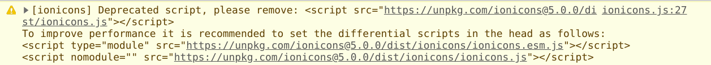

# Jewelry-Store
E-commerce application

## Commit Message Format
Mimic [Angular team's](https://github.com/angular/angular/blob/master/CONTRIBUTING.md#commit-message-format)

```
<type>(<scope>): <subject>
<BLANK LINE>
<body>
<BLANK LINE>
<footer>
```

`<type>`:
- `build`: Changes that affect the build system or external dependencies
- `ci`: Changes to CI configuration files and scripts
- `docs`: Documentation only changes
- `feat`: A new feature
- `fix`: A bug fix
- `polish`: Improving or polishing existing feature(s)
- `perf`: A code change that improves performance
- `refactor`: A code change that neither fixes a bug nor adds a feature
- `style`: Changes that do not affect the meaning of the code (white-space, formatting, missing semi-colons, etc)
- `test`: Adding missing tests or correcting existing tests

`<scope>`:
- `fe`: Frontend related
- `be`: Backend related

#### Sample
```
feat(fe): Add header navigation
```
```
fix(be): Change API endpoint for price - GET

The current API doesn't work well when there's no internet. Look more here: https://github.com/loia5tqd001/Jewelry-Store
```


---
### Naming

- [Atomic architecture structure](https://medium.com/@janelle.wg/atomic-design-pattern-how-to-structure-your-react-application-2bb4d9ca5f97)
- Component file: `my-component.comp.jsx`
- `styled-component` file: `my-component.styled.js`
- utility related to the component: `my-component.utils.js`
- data related to the component: `my-component.data.js`
- test related to the component: `my-component.test.js`
- hooks related to the component: `my-component.hooks.js` **(hooks shared between components will be in the folder hooks/ though)**
- ...

### Setting eslint and Prettier

> If you want to enforce a coding style for your project, consider using _Prettier_ instead of _ESLint_ style rules.

- Source: https://create-react-app.dev/docs/setting-up-your-editor/#displaying-lint-output-in-the-editor

### React slick

- https://react-slick.neostack.com/docs/api
- Add both `react-slick` and `slick-carousel`
- Imported `.css` files from `slick-carousel` in `index.jsx`

### Ionicon

- 100% free, better than Fontawesome (IMO)
- Included the cdn link in `index.html`
- Get the more updated link (than the one in the documentation) from the console window:
  

### Scrape

- Crawl product list
```js
// Sản phẩm mới
a = Array.from(document.querySelectorAll('.wrapper-collection-2 .product-block'))
// Sản phẩm bán chạy
a = Array.from(document.querySelectorAll('.wrapper-collection-2 .product-block'))

b = a.map((x) => {
  const productName = x.querySelector('h3.pro-name a').title;
  const price = x.querySelector('.pro-price');
  let originalPrice = 0;
  if (price.classList.contains('highlight')) {
    originalPrice = price.querySelector('.pro-price-del').innerText;
  } else {
    originalPrice = price.innerText;
  }
  originalPrice = +originalPrice.replace(/,|₫/g, '');
  const sale = x.querySelector('.product-sale span');
  const productSale = sale ? +sale.innerText.replace(/-|%/g, '') : null;
  const pictures = x.querySelectorAll('picture');
  const srcImage = pictures[0].children[1].srcset.slice(2);
  const srcOnHover = pictures[1].children[1].srcset.slice(2);

  return {
    productName,
    srcImage,
    srcOnHover,
    originalPrice,
    productSale,
  };
});
```
